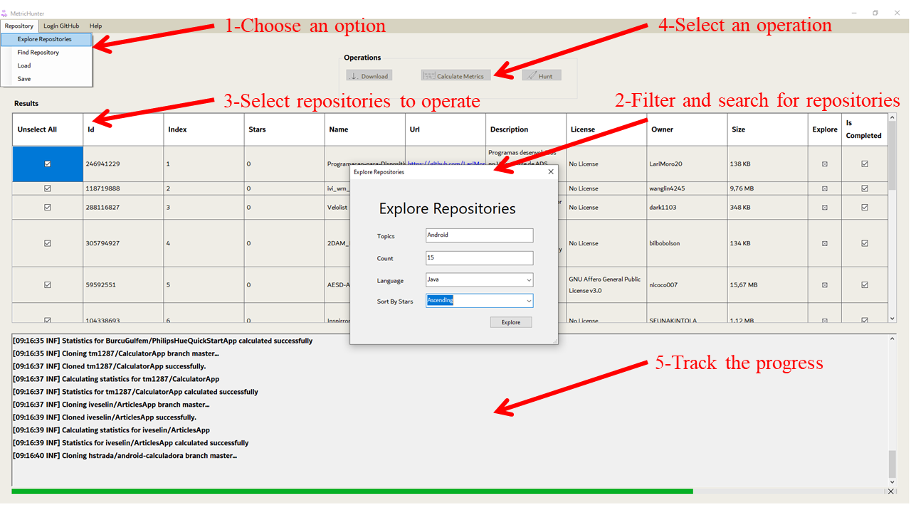
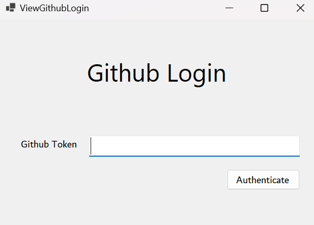

# User Guide

## Introduction

Welcome to the MetricHunter user guide! MetricHunter is a tool that allows developers to find and explore popular
repositories on GitHub. With MetricHunter, you can search for repositories based on language or topic, clone
repositories to your local machine, view repository metrics, make predictions about the success of projects, and
collaborate with other developers.

In this user guide, you will learn how to install and set up MetricHunter, authenticate with your GitHub account, search
for and clone repositories, view repository metrics, make predictions, and access learning resources and community
support.

Whether you are new to MetricHunter or an experienced user, this guide will provide you with the information you need to
get the most out of the tool. So let's get started!

## Installation

Go to MetricHunter [releases page](https://github.com/salihozkara/MetricHunter/releases), click on Assets at the bottom
to show the files available in the release. Please use the appropriate the MetricHunter installer that matches your
machine's architecture. For most, it is x64.

After downloading the executable, run it. You can launch MetricHunter by using the exe file.

## Overview

### Explore Repositories

Explore Repositories option that throws a modal window including a filtering area. The filtering area includes four filtering options to search for the repositories through GitHub API.

### Find Repository

Find Repository option that takes the URL or the name of a specific GitHub repository and allows a user to list the commits or releases over the repository. Once the list of commits or releases is filled, the user can continue with operation selection to construct a dataset.

### Save Search Results

The save search results button in MetricHunter allows you to save the search results you get. (Like add a favourite.)
The repositories are save to json file. You can load them later. If you have an existing json file, you can add new
repositories to it.

### Load Repositories

The load repositories button in MetricHunter allows you to load repositories you saved.

### Search Button

The search button in MetricHunter allows you to search for repositories based on language, topic.

### Download Button

The download button in MetricHunter allows you to clone selected repositories to your local machine.

### Calculate Metrics Button

The calculate metrics button in MetricHunter allows you to calculate metrics of the projects you download.

### Hunt Button

The hunt button is special button in MetricHunter. It is combination of download and calculate metrics buttons. It
allows you to download projects and calculate metrics of them in one click. After completing the operations, it deletes
the repositories and frees up storage.

### Inputs

* **Topics:** Topics are used to help developers find and explore repositories on GitHub that are related to a specific
  subjects or theme. For example, a developer who is interested in Learning about Android development might search for
  repositories with the topic "android".
* **Wanted Count:** Wanted count allows developers to specify the number of repositories they want to retrieve when
  using the tool. For example, if a developer wants to search for repositories with the topic "android" and wants to
  retrieve 10 repositories, they would enter "android" in the topics input and "10" in the wanted count input.
* **Language:** Language is used to help developers find and explore repositories on GitHub that are written in a
  specific programming language. For example, a developer who is interested in learning about Android development might
  search for repositories written in Java.
* **Sort by:** Sort by allows developers to specify how they want to sort the repositories they retrieve when using the
  tool. For example, if a developer wants to search for repositories with the topic "android" and wants to retrieve 10
  repositories, they would enter "android" in the topics input, "10" in the wanted count input, and "stars" in the sort
  by input. This would retrieve the 10 repositories with the most stars that have the topic "android".

## GitHub Authentication

It is generally not possible to use MetricHunter without authenticating with a GitHub account. This is because the
GitHub API, which MetricHunter relies on to access and retrieve information about repositories on the platform, requires
authentication in order to access the API.

Authenticating with a GitHub account allows MetricHunter to increase its rate limit, which is the number of requests
that can be made to the API within a certain timeframe. Without authentication, MetricHunter would have a much lower
rate limit, which could limit the functionality of the tool.

It is generally not recommended to use MetricHunter without authenticating with a GitHub account, as this could
significantly limit the functionality of the tool.

### How to Authenticate

To authenticate with a GitHub account, click on the "Authenticate" button in the top right corner of the MetricHunter
window. This will open a new window in your default browser, where you can log in to your GitHub account and grant
MetricHunter access to your account.

Token is saved in your local machine. So you don't need to authenticate again.

To use a GitHub token with MetricHunter, you will need to create a personal access token in your GitHub account and
provide it to MetricHunter when prompted. You can do this by following these steps:

* Sign in to your GitHub account and navigate to the "**Settings**" page.

* In the left menu, click on "**Developer Settings**".

* Under "**Personal Access Tokens**", click on the "**Generate Token**" button.

* Enter a name for your token and select the appropriate scope(s) for the actions you want to perform with the token.

* Click on the "**Generate Token**" button to create the token.

* Copy the token and provide it to MetricHunter when prompted.
